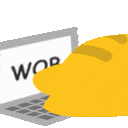

# Heyoo! I'm lissaLuxx!! 

*My name is Elise, I am a passionate developer and maker of arts and crafts\*!* 

*: ohoho I make cupcakes and that is art as far as I'm concerned, oh yeah I'm also a writer. 

## About me

  I am a latina girl native to Brazil! Currently working on developing the skills necessary to create beautiful, elegant code and whatever else comes to mind!

🔭 Currently working on low level coding and languages, such as C and Rust

📚 CS student at [IFNMG](https://ifnmg.edu.br/)!

## Technologies I use:

## My GitHub Stats:

<!--
**lissaLuxx/lissaLuxx** is a ✨ _special_ ✨ repository because its `README.md` (this file) appears on your GitHub profile.

Here are some ideas to get you started:

- 🔭 I’m currently working on ...
- 🌱 I’m currently learning ...
- 👯 I’m looking to collaborate on ...
- 🤔 I’m looking for help with ...
- 💬 Ask me about ...
- 📫 How to reach me: ...
- 😄 Pronouns: ...
- ⚡ Fun fact: ...
-->
